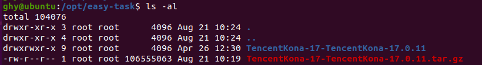

# 犀牛鸟初阶任务

- [犀牛鸟初阶任务](#犀牛鸟初阶任务)
  - [编译 jdk](#编译-jdk)
  - [测试样例](#测试样例)
    - [SerialGC](#serialgc)
    - [ParallelGC](#parallelgc)
    - [G1GC](#g1gc)
    - [ZGC](#zgc)
    - [ShenandoahGC](#shenandoahgc)

## 编译 jdk

因为后续我们需要对 jdk 的源码进行修改，所以最简洁的一个方法就是自己编译一套 jdk 出来，然后后续进行修改的话，就会变得更加方便。

对于编译 jdk，我主要参考了下面这篇文章：https://openjdk.org/groups/build/doc/building.html

1. 下载 Tencent Kona JDK 17.0.11 的源码：https://github.com/Tencent/TencentKona-17/releases/tag/TencentKona-17.0.11 并进行解压：
    
    
    
2. 运行 `bash configure` 命令
    
    这一步中，主要需要解决以下几个问题：
    
    1. 安装 autoconf
        
        ```bash
         sudo apt-get install autoconf
        ```
        
    2. 安装 gcc 13.2.0 版本
        
        ```bash
        wget https://mirrors.ustc.edu.cn/gnu/gcc/gcc-13.2.0/gcc-13.2.0.tar.xz
        
        tar -xvf gcc-13.2.0.tar.xz
        
        cd gcc-13.2.0 && mkdir build && cd build
        
        ../configure --disable-multilib
        
        make -j8
        make install
        ```
        
        
        
    3. 设置 boot jdk
        
        ```bash
        wget https://download.oracle.com/java/17/archive/jdk-17.0.11_linux-x64_bin.tar.gz
        tar -zxvf jdk-17.0.11_linux-x64_bin.tar.gz
        ```
        
        ```bash
        bash configure --with-boot-jdk=/opt/jdk-17.0.11
        ```
        
    4. 根据提示信息，下载一些库即可。
    
    
    
3. 运行 `make images` 命令
    
    
    
4. 验证编译的 jdk 的版本，如下图所示，我们已经正确的编译了 TencentKona-17.0.11  版本的jdk。
    
    
    

至此，初阶任务的第一个问题，已经解决

## 测试样例

对于本次要验证的不同 GC 情况，我实现了代码：

```java
import java.util.*;

public class Main {
    public static void main(String[] args) {
        List<byte[]> memoryHog = new ArrayList<>();
        // 循环 50 次
        // 总垃圾： 50*625 MB ≈ 31.5 GB
        for(int i = 0;i < 50;i++) {
            // 每次产生 10000*1024*64 字节数据 = 625 MB
            for(int j = 0;j < 10000;j++) {
                // 每次新增 64 KB 数据
                memoryHog.add(new byte[1024*64]);
            }
            memoryHog.clear();
        }
    }
}
```

每一次会往 memoryHog 中添加 64KB 数据，每次会重复 10000 次，也就是625MB的数据，然后会进行 memoryHog 的清理，这个过程会重复50次，总共会产生 31.5 GB 垃圾。

我在 IDEA 中使用了我编译好的 jdk 作为本次实验所用的 jdk。


每次运行，直接在 IDEA 中输入所需的 jvm 参数即可。


我主要使用了下面的参数进行本次初阶任务的实验。

```bash
-Xms512m -Xmx1g -XX:+UseSerialGC -Xlog:gc:/opt/easy-task/demo/demo-test/log/SerialGC.log

-Xms512m -Xmx1g -XX:+UseParallelGC -Xlog:gc:/opt/easy-task/demo/demo-test/log/ParallelGC.log

-Xms512m -Xmx1g -XX:+UseG1GC -Xlog:gc:/opt/easy-task/demo/demo-test/log/G1GC.log

-Xms512m -Xmx1g -XX:+UseZGC -Xlog:gc:/opt/easy-task/demo/demo-test/log/ZGC.log

-Xms512m -Xmx1g -XX:+UseShenandoahGC -Xlog:gc:/opt/easy-task/demo/demo-test/log/ShenandoahGC.log
```

我主要使用了 gceasy 对输出的结果进行了分析，相关日志我放在同目录仓库中。

[gceasy.io](https://gceasy.ycrash.cn/gc-dashboard.jsp)

### SerialGC

- GCEasy 实验结果（主要分析 GC暂停时间，测试完成时间，GC吞吐率 ）
    
    GC相关参数（包含 GC 暂停时间）
    
    
    
    测试完成时间
    
    
    
    GC吞吐量
    
    
    

从上面的实验结果中，我们可以看到对于 SerialGC ，整体持续时间为 9.298s，GC暂停的时间为 5.528s，这对于整体来说，消耗的时间是非常长的，其中 Minor GC 的时间为 3.288s ，Full GC 的时间为 2.240s。如果看吞吐量的话，它的吞吐率是非常低的，只有 40.55%。

下面可以分析一个 SerialGC 的 log 文件：

```
[0.007s][info][gc] Using Serial
[0.355s][info][gc] GC(0) Pause Young (Allocation Failure) 136M->128M(494M) 118.514ms
[0.498s][info][gc] GC(1) Pause Young (Allocation Failure) 265M->263M(494M) 128.780ms
[0.637s][info][gc] GC(2) Pause Young (Allocation Failure) 400M->399M(536M) 117.310ms
[0.651s][info][gc] GC(3) Pause Full (Allocation Failure) 399M->399M(924M) 13.945ms
[0.921s][info][gc] GC(4) Pause Young (Allocation Failure) 637M->595M(924M) 180.366ms
[0.951s][info][gc] GC(5) Pause Young (Allocation Failure) 850M->850M(924M) 0.042ms
[1.015s][info][gc] GC(6) Pause Full (Allocation Failure) 850M->263M(924M) 64.218ms
[1.112s][info][gc] GC(7) Pause Young (Allocation Failure) 518M->517M(924M) 74.206ms
[1.136s][info][gc] GC(8) Pause Young (Allocation Failure) 772M->772M(924M) 0.030ms
[1.167s][info][gc] GC(9) Pause Full (Allocation Failure) 772M->146M(924M) 31.281ms
[1.236s][info][gc] GC(10) Pause Young (Allocation Failure) 402M->400M(924M) 48.563ms
```

SerialGC总共进行了 171次，后面都是重复的过程，我们可以看到在进行了3次 Young GC 之后，需要进行一个 Full GC，后面因为每一次都有前面 GC 过程中遗留下来的垃圾，所以 Young GC 和 Full GC 之间的时间间隔会逐渐减少。

### ParallelGC

- GCEasy 实验结果（主要分析 GC暂停时间，测试完成时间，GC吞吐率 ）
    
    GC相关参数（包含 GC 暂停时间）
    
    
    
    测试完成时间
    
    
    
    GC吞吐量
    
    
    

从上面的实验结果，我们可以看到本次 GC 的一共持续了 16.704 s，GC 暂停时间为 10.783s，其中 Minor GC 共持续了 6.768s，Full GC 共持续了 4.15s，对于整体时间来说 ，暂停时间是非常长的。而 ParallelGC 的吞吐率也是非常低的，只有 35.444%。

可能是因为我们的代码数据量比较小，我查到 “The parallel collector is intended for applications with medium-sized to large-sized data sets that are run on multiprocessor or multithreaded hardware.”，Parallel GC 可能更适用于运行的具有中型到大型数据集的应用程序，所以对于我们的这个测试demo，并没有看到它对比 Serial GC 展现出来过大的提升。

对于它的 GC log 文件：

```
[0.009s][info][gc] Using Parallel
[0.281s][info][gc] GC(0) Pause Young (Allocation Failure) 128M->120M(491M) 33.745ms
[0.350s][info][gc] GC(1) Pause Young (Allocation Failure) 248M->247M(619M) 45.452ms
[0.409s][info][gc] GC(2) Pause Full (Ergonomics) 247M->247M(824M) 58.245ms
[0.563s][info][gc] GC(3) Pause Young (Allocation Failure) 504M->503M(866M) 75.228ms
[0.627s][info][gc] GC(4) Pause Full (Ergonomics) 503M->503M(1003M) 63.493ms
[0.712s][info][gc] GC(5) Pause Full (Ergonomics) 802M->177M(1003M) 44.385ms
[0.791s][info][gc] GC(6) Pause Young (Allocation Failure) 476M->474M(1003M) 50.087ms
[0.814s][info][gc] GC(7) Pause Full (Ergonomics) 474M->474M(1003M) 22.504ms
[0.871s][info][gc] GC(8) Pause Full (Ergonomics) 773M->145M(1003M) 25.610ms
[0.954s][info][gc] GC(9) Pause Young (Allocation Failure) 444M->442M(1003M) 52.739ms
[1.058s][info][gc] GC(10) Pause Full (Ergonomics) 442M->442M(1003M) 103.822ms
[1.167s][info][gc] GC(11) Pause Full (Ergonomics) 741M->113M(1003M) 56.730ms
[1.254s][info][gc] GC(12) Pause Young (Allocation Failure) 412M->410M(1003M) 48.520ms
```

Parallel GC 总共持续了 266次，每次 GC 后内存减少显著，但整体仍保持在 400 MB 到 500 MB 之间。在测试过程中，GC 触发频繁。由于堆内存限制较小（1 GB），GC 需要频繁运行来释放内存，避免应用程序因内存不足而崩溃。

### G1GC

- GCEasy 实验结果（主要分析 GC暂停时间，测试完成时间，GC吞吐率 ）
    
    GC相关参数（包含 GC 暂停时间）
    
    
    
    
    
    测试完成时间
    
    
    
    GC吞吐量
    
    
    

从上面的实验结果中，我们可以看到 G1 GC 总共持续了 11.114s，可以统计出5个阶段的时间，Young GC 花费 8.270s，Concurrent Marking 花费 6.057s，Full GC 花费 1.039s，Remark阶段花费 0.127s，Cleanup 阶段花费 0.0218s。我们可以看到 STW 的时间总共为 7.335s，而 Concurrent 时间为 6.057s，因为我给 jvm 设置参数比较小，最大堆只有 1G ，并不能发挥出 G1 GC 的全部性能，所以结果比较差，G1 GC 的吞吐量只有 34.005%。

对于 G1 GC 的相关日志分析，可以查看我之前对  https://github.com/Tencent/TencentKona-17/issues/25 的分析：[https://github.com/fly-beep/jvm_analysis/blob/master/2024犀牛鸟 G1 VS ZGC.md#g1-日志举例分析](https://github.com/fly-beep/jvm_analysis/blob/master/2024%E7%8A%80%E7%89%9B%E9%B8%9F%20G1%20VS%20ZGC.md#g1-%E6%97%A5%E5%BF%97%E4%B8%BE%E4%BE%8B%E5%88%86%E6%9E%90)

### ZGC

- GCEasy 实验结果（主要分析 GC暂停时间，测试完成时间，GC吞吐率 ）
    
    GC 之后堆的变化：
    
    
    
    GC 之前堆的变化：
    
    
    

对于 ZGC 的相关日志分析，可以查看我之前对  https://github.com/Tencent/TencentKona-17/issues/25 的分析：[https://github.com/fly-beep/jvm_analysis/blob/master/2024犀牛鸟 G1 VS ZGC.md#zgc-日志举例分析](https://github.com/fly-beep/jvm_analysis/blob/master/2024%E7%8A%80%E7%89%9B%E9%B8%9F%20G1%20VS%20ZGC.md#zgc-%E6%97%A5%E5%BF%97%E4%B8%BE%E4%BE%8B%E5%88%86%E6%9E%90)

### ShenandoahGC

- GCEasy 实验结果（主要分析 GC暂停时间，测试完成时间，GC吞吐率 ）
    
    GC相关参数（包含 GC 暂停时间）
    
    
    
    
    
    测试完成时间
    
    
    
    GC吞吐量
    
    
    

从上面的实验结果中，我们可以看到 ShenandoahGC 总共持续了 4.419s，它的性能相比于上面的 GC 收集器来说，效果是最好的，Concurrent Marking 总共花费了 0.278s，Pause Final Mark 消耗了 0.042s，Pause Initial Mark 花费了 0.0108s，Concurrent Cleanup 阶段使用了 0.0088s，Concurrent Update 阶段花费了 0.00414s，Concurrent Evacuation 使用了 0.00283s，Pause Final Update 阶段使用了 0.000649s，Pause Init Update阶段使用了 0.0000770s。在这几个阶段中，Pause Final Mark、Pause Initial Mark、Pause Final Update，Pause Init Update这四个阶段是 STW 的。而 ShenandoahGC  的吞吐量是非常高的，达到了 98.789%。

下面对 ShenandoahGC  的 log 日志进行分析：

```
[0.026s][info][gc] Heuristics ergonomically sets -XX:+ExplicitGCInvokesConcurrent
[0.026s][info][gc] Heuristics ergonomically sets -XX:+ShenandoahImplicitGCInvokesConcurrent
[0.027s][info][gc] Using Shenandoah
[0.388s][info][gc] Trigger: Learning 1 of 5. Free (716M) is below initial threshold (716M)
[0.388s][info][gc] GC(0) Concurrent reset 0.364ms
[0.389s][info][gc] GC(0) Pause Init Mark (unload classes) 0.391ms
[0.389s][info][gc] GC(0) Concurrent marking roots 0.406ms
[0.406s][info][gc] GC(0) Concurrent marking (unload classes) 16.547ms
[0.406s][info][gc] GC(0) Pause Final Mark (unload classes) 0.248ms
[0.407s][info][gc] GC(0) Concurrent thread roots 0.486ms
[0.407s][info][gc] GC(0) Concurrent weak references 0.040ms
[0.407s][info][gc] GC(0) Concurrent weak roots 0.275ms
[0.407s][info][gc] GC(0) Concurrent cleanup 246M->246M(512M) 0.045ms
[0.407s][info][gc] GC(0) Concurrent class unloading 0.317ms
[0.408s][info][gc] GC(0) Concurrent strong roots 0.107ms
[0.408s][info][gc] GC(0) Concurrent evacuation 0.163ms
[0.408s][info][gc] GC(0) Pause Init Update Refs 0.007ms
[0.411s][info][gc] GC(0) Concurrent update references 3.024ms
[0.411s][info][gc] GC(0) Concurrent update thread roots 0.402ms
[0.412s][info][gc] GC(0) Pause Final Update Refs 0.069ms
[0.412s][info][gc] GC(0) Concurrent cleanup 252M->250M(512M) 0.036ms
[0.413s][info][gc] Trigger: Learning 2 of 5. Free (684M) is below initial threshold (716M)
[0.414s][info][gc] GC(1) Concurrent reset 0.876ms
[0.414s][info][gc] GC(1) Pause Init Mark (unload classes) 0.030ms
[0.415s][info][gc] GC(1) Concurrent marking roots 0.414ms
[0.417s][info][gc] GC(1) Concurrent marking (unload classes) 2.833ms
[0.418s][info][gc] GC(1) Pause Final Mark (unload classes) 0.441ms
[0.418s][info][gc] GC(1) Concurrent weak references 0.072ms
[0.418s][info][gc] GC(1) Concurrent weak roots 0.266ms
[0.418s][info][gc] GC(1) Concurrent cleanup 252M->252M(512M) 0.036ms
[0.419s][info][gc] GC(1) Concurrent class unloading 0.356ms
[0.419s][info][gc] GC(1) Pause Final Roots 0.002ms
[0.423s][info][gc] Trigger: Learning 3 of 5. Free (684M) is below initial threshold (716M)
```

ShenandoahGC  的日志类似上面这样，ShenandoahGC  一个进行了 60 次 GC 。首先在 GC(0) 的时候，GC 在堆内存接近初始阈值（716MB）时被触发。这反映了在每次内存填充循环后，堆内存使用迅速增加。由于测试代码在短时间内反复分配大量内存，并且堆内存设置为 1GB，系统多次接近内存阈值，从而频繁触发垃圾回收。例如，在 `0.388s` 时，日志记录了第 0 次 GC 的触发，原因是可用内存（716MB）低于初始阈值（716MB）。类似地，第 5 次 GC 在 `0.884s` 时触发，此时可用内存仅为 101MB，低于最小阈值 102MB。
Shenandoah GC 通过多阶段的并发操作减少应用程序暂停时间。日志中显示了每次 GC 的多个关键阶段包括并发重置（Concurrent reset）、初始标记（Pause Init Mark）、并发标记（Concurrent marking）、最终标记（Pause Final Mark）、引用更新（Concurrent update references）和类卸载（Concurrent class unloading）等阶段。。这些阶段的暂停时间非常短，通常仅在微秒或毫秒级别。例如，第 0 次 GC 的 `Pause Init Mark` 仅耗时 0.391ms，`Pause Final Mark` 耗时 0.248ms，表明 Shenandoah GC 成功保持了低延迟。

GC 操作频繁发生，大约每次内存分配循环触发一次。尽管 GC 次数较多，但每次暂停时间都很短，未对应用程序产生明显影响。这说明在内存分配密集的场景下，Shenandoah GC 能够有效控制暂停时间并保持系统响应性。